# Bloom Clock Simulation

## Introduction
In this project, the bloom clocks have been used between different processes to simulate message-passing and clock updates. The feasibility of bloom clocks is studied in replacing vector clocks for determining the partial ordering of events in a distributed environment. 
The major advantage of bloom clocks is that they are space-efficient probabilistic data structures. In vector clocks, each process must maintain a clock whose size is equal to the total number of processes running in a distributed environment. Bloom clocks on the other hand can be a fixed sized clock while still promising a way to determine partial ordering. 
Bloom clocks are based on the bloom filter data structure. Due to such a probabilistic data structure, false negative can never occur in it. But still false positives may occur and the simulations within this project aims to study the severity of these false positives. Various metrics and estimations are used to study the same.
This report will go through how the code for the simulations can be run and reproduced. It will also go through the implementation details, what simulations were run, results from these simulations, and finally analysis of the results.

## Implementation details and design decisions
### Programming language and libraries
The code for the simulations has been implemented in the Python programming language. The environment set for Python was version 3.7 and above. Some of the important libraries used were:
* Multiprocessing:
  - for creating independent processes.
  - It also contains various message-passing data structures, from which Queue data structure was used.
* Numpy:
  - for storing clock vectors and running statistical calculations on them.
* Time:
  - for introducing sleep between each event of a process.
* Random:
  - for randomization of simulations.
* Matplotlib:
  - for plotting different graphs and tables.

### Code structure
The code itself consists of three parts:
1. Driver code: It sets various parameters for the simulations and starts or stops all the children/worker processes. This code is run in the parent process that starts all the worker processes for the simulation. The driver code uses for loop to run simulations for all combinations of parameters.
2. Process code: This is the code that represents the working of each process. Every process is essentially a copy of this function running independently. Each process performs send, internal, and receive events till the shared variable GSN does not exceed an upper limit (defined beforehand).
3. Metrics: When all the simulations are run, this part is where all the data collected is processed and plotted or tabulated. Various helper functions are defined where each does its own part, like computing the probability of positive, accuracy, and so on.
Each process code further consists of three parts, representing a send, internal, and receive event. They can call a helper function to calculate the hash values and update the vector and bloom clocks. The hash function used is Python’s inbuilt hash function and it was computed based on (id, x, seed). Where id is the process id at which the hash is being computed, x is the event number at that process, and seed is a unique integer for each hash function. Queues are used for inter-process communication (message-passing) and send, internal, and receive events are always executed in a round-robin manner.
The queue at its own process is used only for receiving messages, while the queue of other processes is used to send a message to it. Internal events are simulated by just updating the GSN and sleeping the process for some time.

### Design issues and its solution
Now due to the way of how multiprocessing works in Python, even though multiple processes can be created at the same time, it is not possible to start each process at the same time. So, a process with an id, say 0, may start way before a process of id 300. This may lead to an odd behavior, where the process 0 is the first one to send a message in every simulation. We always want to avoid such specific ordering in asynchronous simulations. Hence, at the start of a simulation each process must wait for an amount of time inversely proportional to its process id. For example, for 100 processes, process 0 will wait for one whole second while process 99 will hardly have to wait before starting with any event. This design of waiting can be called a warm-up time. It gives all the processes a fair chance at being the first one to start an event.
Each process also sleeps for some amount of time after each event. To induce randomness, this time can range anywhere from 0 to 1 second. One interesting observation when there was no sleep between events at a process was that few processes kept sending and receiving messages while the rest did not even perform a single event. This might be because the OS might not be able to start other processes when a few are using up all the computational power for the simulation. This is due to starting hundreds of processes for the simulations. Hence, when a significant sleep time was introduced, more processes were able send or receive some messages, instead of a few processes sending and receiving almost all the messages. 
Now, for computing the metrics, one major hurdle was the time complexity of calculating the accuracy, precision, and false positive rate with and without the vector clocks. The code spends most of the time calculating the probability of a positive for all pairs of events y and z. Hence, to optimize this part, the approximation of the binomial distribution is used instead. This approximation certainly cut down the time for each simulation to compute its metrics.
Finally, for part 7 of the experiment, we need to compute pr_p for all pair of events (x, x’) in the execution slice. If x’ is an event from the start of the execution slice and x from the end, there are cases where n < k for n choose k in the binomial function. Since it is not possible to find different ways to choose more than n from n items, such a combination simply returns 0.

## Instructions to run
The steps to run the code for creating or recreating simulations is as follows:
1.	Make sure to have at least a Python 3 interpreter.
2.	Install all the necessary libraries listed in the imports or from the requirements.txt file.
3.	Set a seed as an environment variable to reproduce similar results for each run.
4.	Set various parameters such as the number of processes, internal event probability, the execution slice, etc.
5.	Run the simulation and wait for the program to display/return all the results.

## Simulations run
Multiple runs were executed for each simulation and within those runs, the data that didn’t deviate a lot was chosen for results and analysis. This was done to discard any outlier data. Here various variables are used to represent a parameter. They are given below,
* Number of processes = n
* Size of bloom clocks = m
* Number of hash functions = k
Of all the simulations, the main simulations that will be discussed in this report in some way or other were run for the following parameters:
1.	n = 100, 200 and 300
2.	m = 0.1n, 0.2n, 0.3n
3.	k = 2, 3, 4
4.	Internal probability = 0.0, 0.5 and 0.9
5.	Execution slice upper bound = 0.5(n^2 + 10n), (n^2 + 10n) and 2(n^2 + 10n)
Since part 7 is computationally intensive even after using the efficient estimation of probabilities, it has only been run for n = 100 (and all the m and k combinations).
      
## Results and analysis
### Changing n (keeping the rest constant)
Since m was run for 0.1n, 0.2n and 0.3n, it is not possible to find a common m value between the different n runs (i.e. n = 100, 200, 300). Instead the closest m values will be picked to display the results (m = 20 and 30). Also, a middle value k = 3 is selected.   

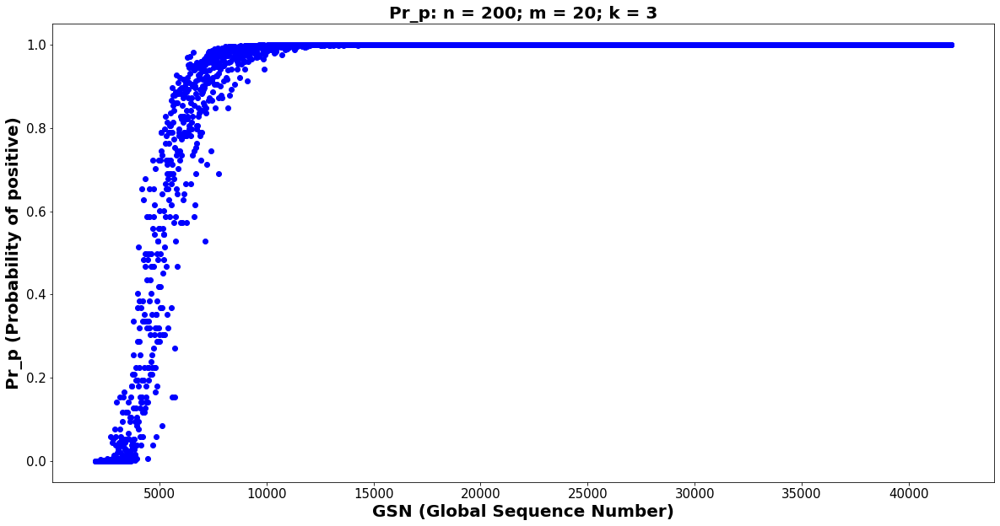
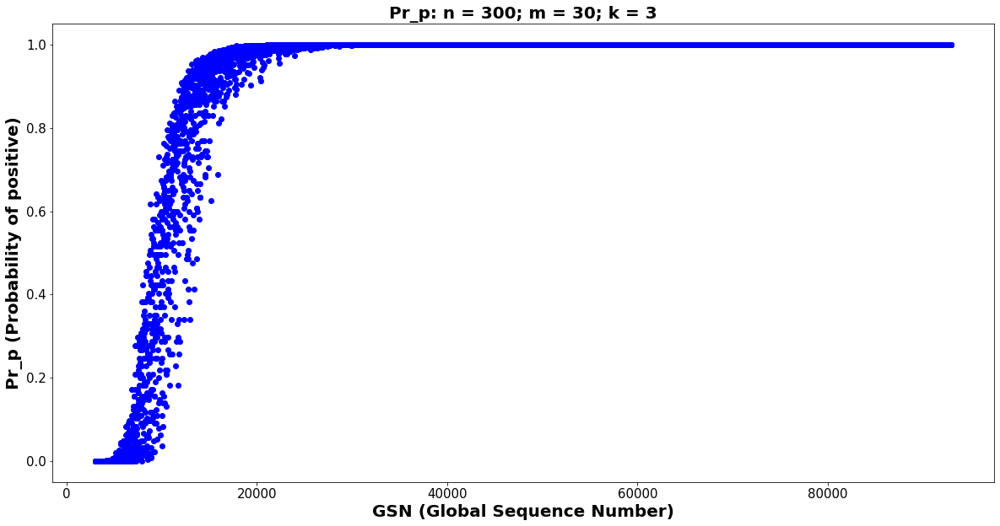
The above three plots show the probability of positive (given by equation 4). The curve is sharper as the value of n increases, but the scale of the x-axis is also different. In fact, for n = 100, pr_p of 1.0 can be seen at around 4000 gsn, but for n = 200, the points reach 1.0 at gsn greater than 5000 and for n = 300 this gsn is even greater.
Hence, as the number of processes increases, the gsn at which pr_p reaches 1.0 also increases, which seems to indicate a direct relation between them. That is, for higher n, the same likelihood of a positive would be noticed farther away from the event y in logical time. Now let’s take a look at the plots for pr_fp (for (1-pr_p)pr_p equation). 

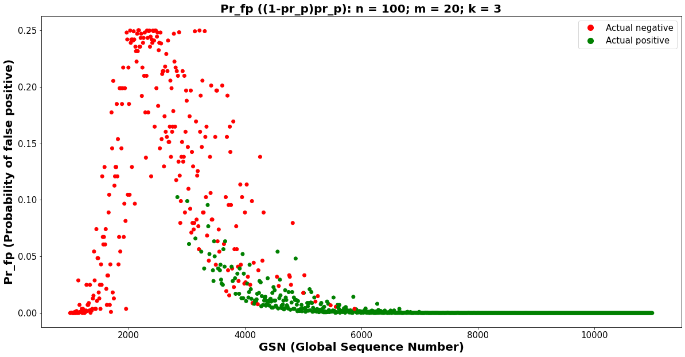 
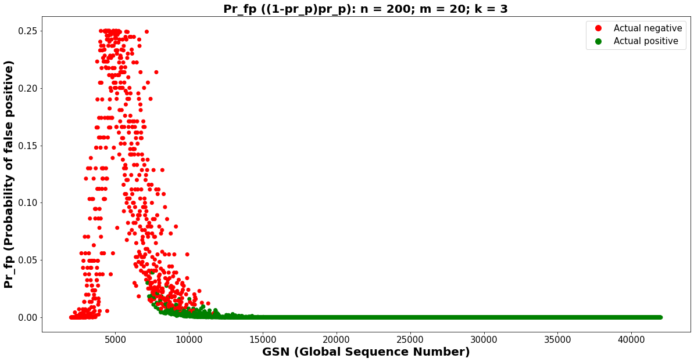
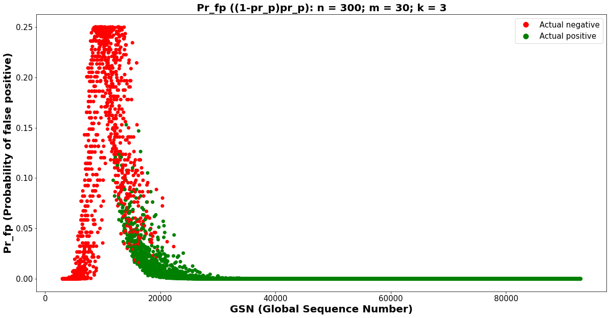
A gaussian curve can be observed for the pr_fp plot. If we consider the middle of this gaussian-like curve as mean, then a similar trend can be seen here. As n increases, this mean can be observed at a higher gsn value. So, we are more likely to observe false positive farther away from the event y. Also, using the approximation function for faster calculations has caused the probability to increase in steps, since there are consistent gaps between probability values for n = 300. One interesting point to note, for n = 300, a lot of points in the curve of false positive are actual positive points. But for smaller n, in the curve, they are mostly actual negatives.

### Changing m (keeping the rest constant)
Here, we keep n constant at 200 and k again at 3. 

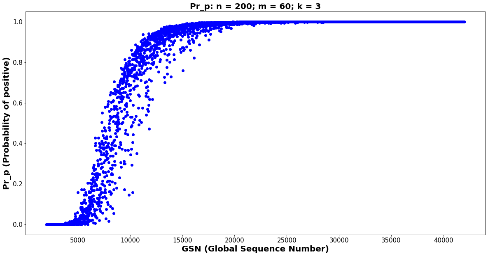 
For different m values, the probability of positive can be seen to be increasing at different rates and at different points. When the value of m increases, the probability starts increasing at a later point in terms of gsn. Also, the rate of increase of probability is higher for smaller m values, as the m = 20 the curve is certainly sharper. It means that the likelihood of finding a positive at the start is higher for smaller m value. Now for the probability of false positive, we have the following plots. 

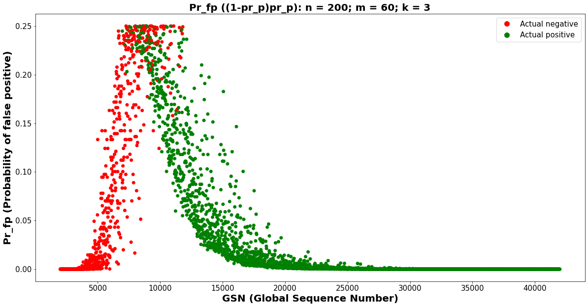  
Like the previous plots, as m increases, the pr_fp starts increasing at a later point as well as grows slowly. Hence, the gaussian curve is also wider for higher m values. This is consistent with the previous plots because where the likelihood of positives is high, the likelihood of false positives is also high. Also, the plot is also more accurate for the smaller m value. For m = 20, the curve where the probability of false positive spikes are actual negatives, but for m = 60, half of them are actual positive points.

### Changing k (keeping the rest constant)
For this, we will choose, again n = 200 and m = 40.

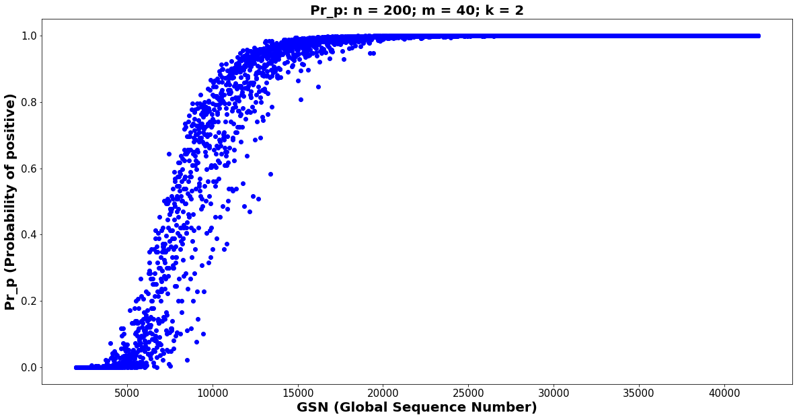
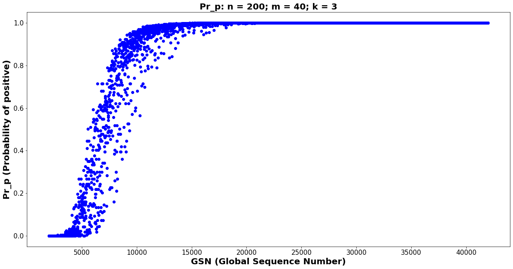
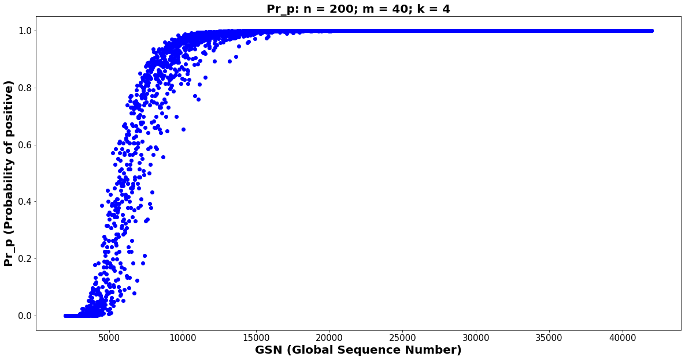 
For different k values, the probability pr_p starts increasing at the same point in terms of gsn, they all start at around 5000. But, when more hash functions were used, the steeper the curve became. This may be because as the number of hash functions increase, the higher will be the difference between bloom clock of event y and event z. This leads to the probability of positive increasing faster for the k = 4.

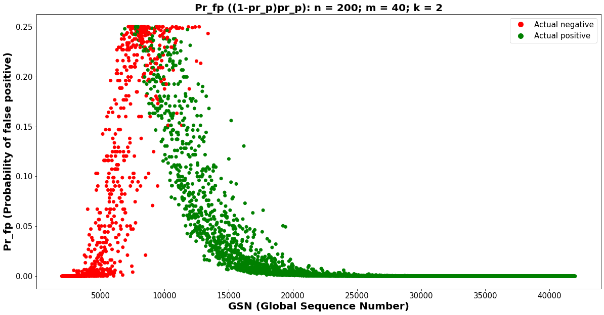
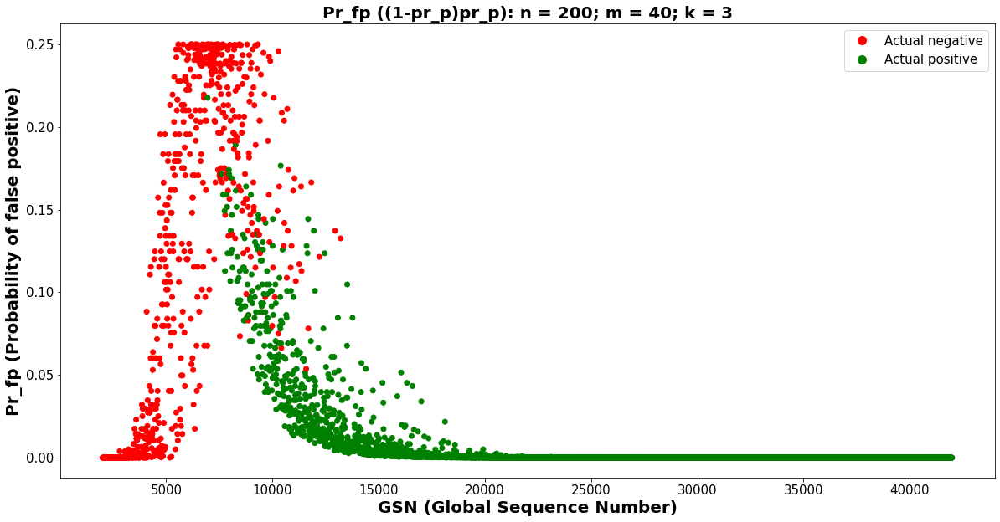
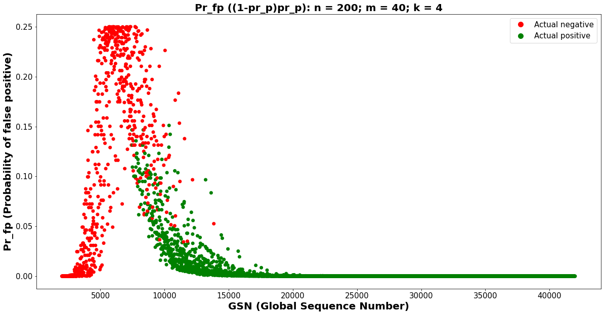 
The pr_fp plots show that as we increase the number of hash functions, the false positives are likely to be observed earlier in terms of gsn. As the actual positives and actual negatives, it is completely opposite to the one where we varied the size of bloom clock. That is, the actual positives tell us that the probability is more accurate for higher k value. For k = 2, one half of the gaussian curve is actual negative while the other half is actual positive.

### Changing internal event probability (keeping the rest constant)
Here, let’s keep n constant at 100, m at 20 and k at 3.

For probability of internal event = 0:

For probability of internal event = 0.5:
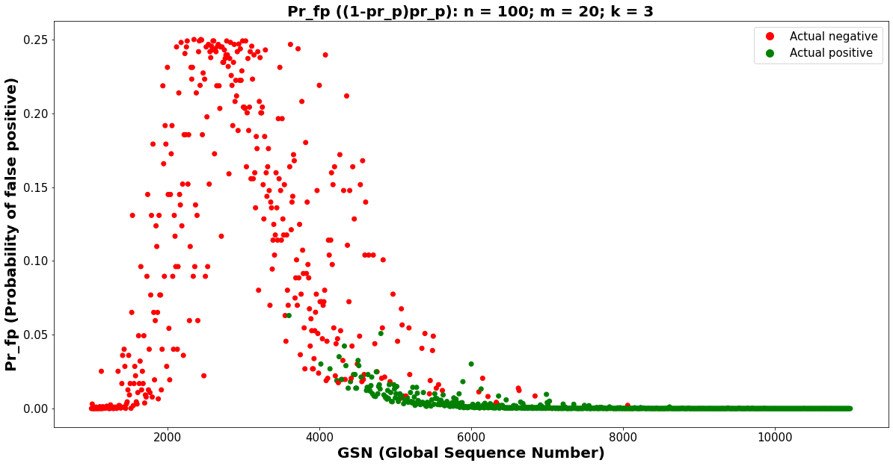

For probability of internal event = 0.9:
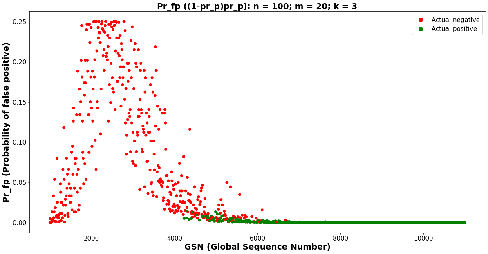

The plots for pr_p looked almost the same for different values. Maybe changing the probability of an internal event didn’t affect the probability of positives much. It would be better to look at the actual metrics later in the report. The same also be seen for the probability of false positive plots above. The only difference to make out is that actual positives start appearing later when the probability of an internal event is higher.

### Changing execution slice range (keeping the rest constant)
For n = 100, m = m = 20 and k = 3, we have the following.

For upper bound = n^2 + 10n:
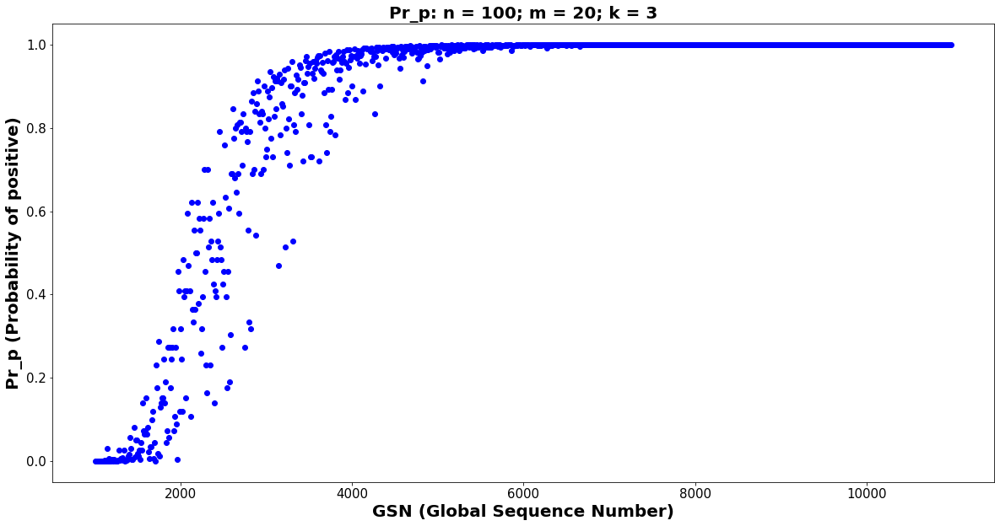

For upper bound = 0.5n^2 + 10n:
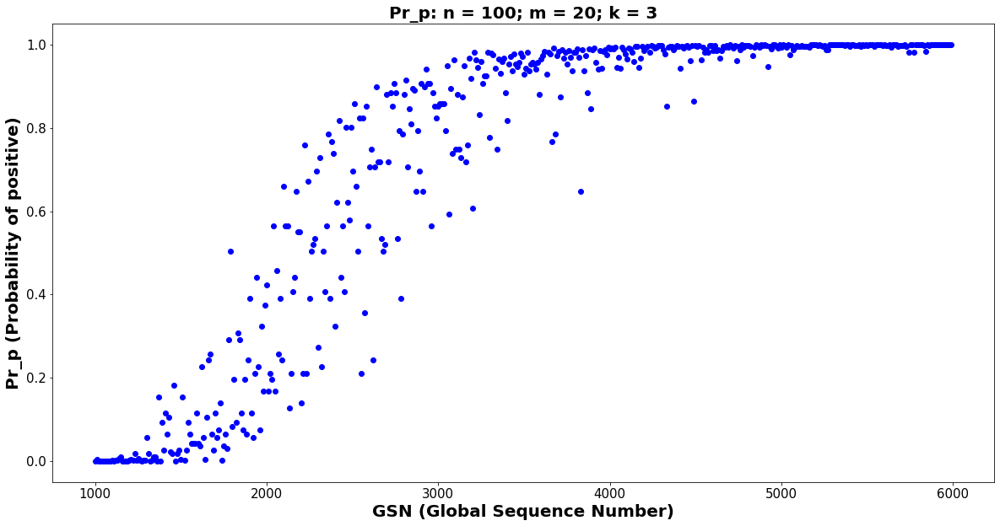

For upper bound = 2n^2 + 10n:
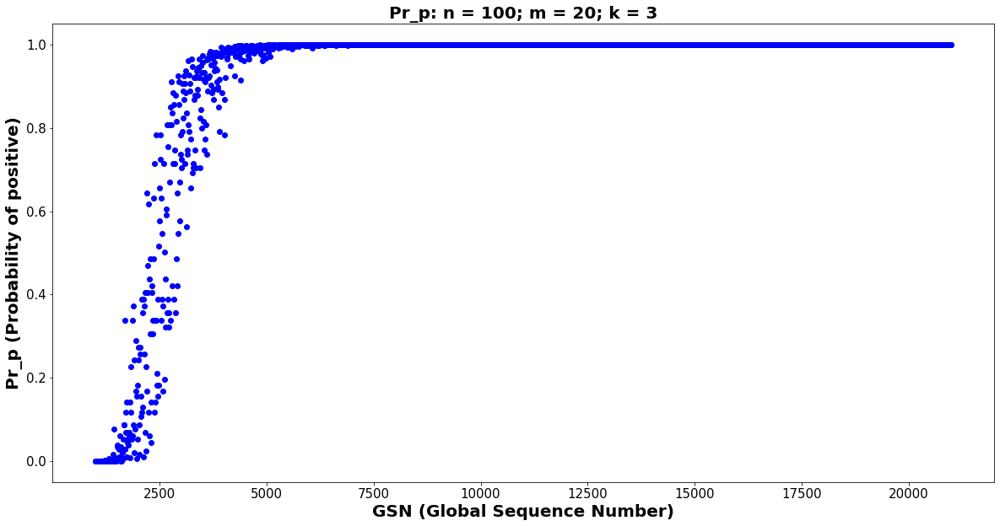
Since, we are only changing the execution slice between which we capture the events and not the parameters that affect the simulation. The data for all three looks similar. When the upper bound is half the original, we get a detailed look at the data, at least for n = 100. On the other hand, for double the original upper bound, much of the data has constant 1 probability and isn’t of much use. Thus, changing the execution slice gives us better idea of where the interesting part of the data lies. Similar results were observed for the pr_fp plots. This shows that the upper bound could be reduced to get the important part of the data. How the change in execution slice affects the metrics will be seen later on.

### Comparing pr_fp for two different equations
For calculating the probability of false positive, we have two equations:
1.	(1-pr_p)pr_p
2.	(1-pr_p)pr_{delta(p)}

Comparing them for n = 300, m = 60, k = 3.
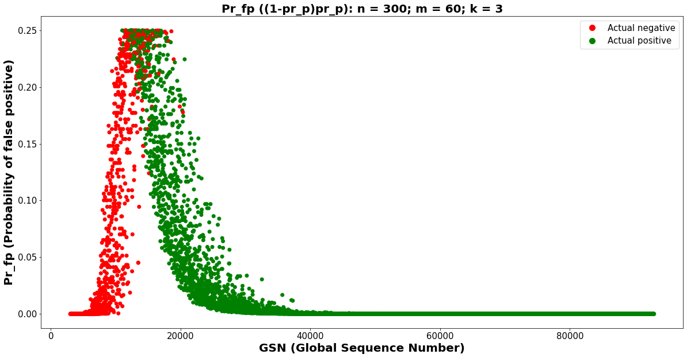
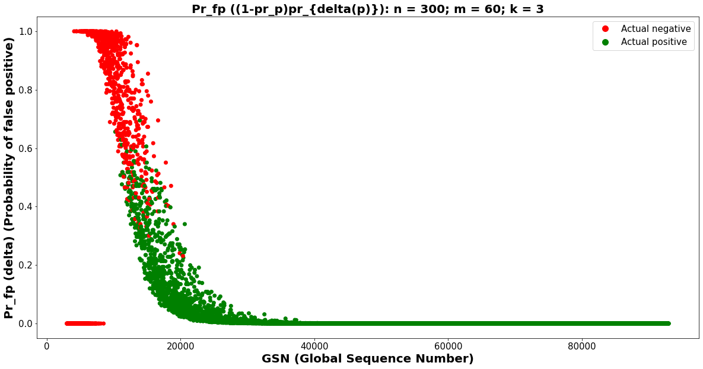
Due to the probability of false positive being the multiplication of probability of positive and the remaining probability (1-pr_p), the maximum value attainable is 0.25 as can be seen in the plots. But for the delta equation, it is not limited to such a value. Also, the delta plot isn’t exactly like a gaussian curve. It tells us that pr_fp will be 0 at the at the start but then false positive is most likely to happen. Once bloom clock for event z is greater than or equal to the bloom clock for y, the probability suddenly spikes to 1 then slowly decreases. It seems to be more accurate in terms of actual positives and actual negatives.

### Comparing actual metrics
The following tables contain the actual metrics for different n, m and k values.

For n = 100 (with 0 internal event probability):
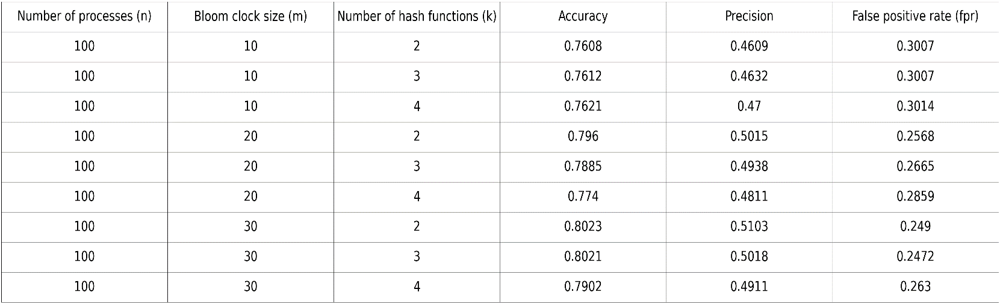
From the above, the accuracies for the bloom clocks are good. They are in the 70’s and the 80’s range in terms of percentage. But recall, how many of the positives were true positives revolves around the 50 mark. Also, the values seem to be better for larger bloom clock size (which is also theoretically true, for example, when m approaches n). But the reverse is true for k, as the number of hash functions are increased, the metrics take a slight hit.

For n = 100 (with 0.5 internal event probability):
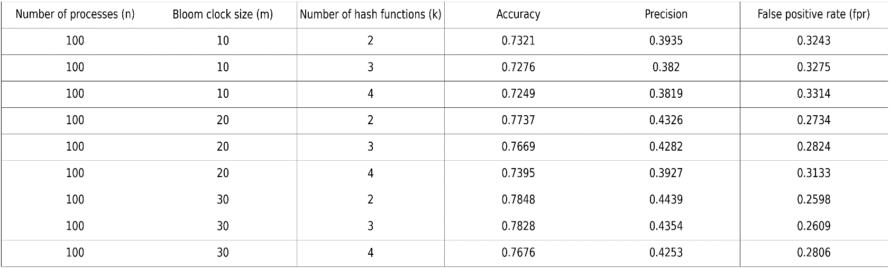
When we have introduced the internal events, the accuracy and precision has gone down a bit while the false positive rate has gone up. Otherwise the trend is like the previous one.

For n = 100 (with 0.9 internal event probability):
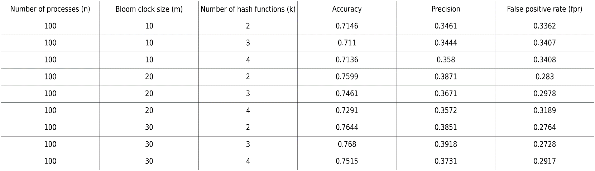
Again, as the internal event probability is increased, the metrics seem to be affected more. In general, more false positives occur as more internal events take place. Since, for an internal event, the updates take place at a single process, a process P_i might have its bloom clock with larger values than process P_j even though the event at P_i has taken place earlier in logical time. Hence, the general idea is to reduce the internal events as much as possible to avoid drastically affecting the metrics.

For n = 100 (with half the upper bound):
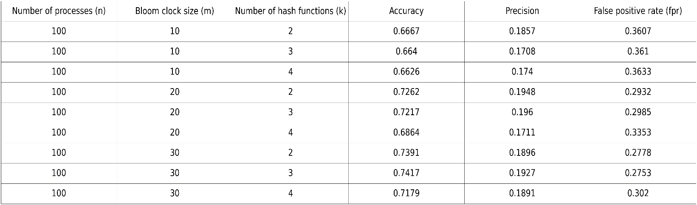
With half the upper bound, we are ignoring events far away from event y. These events were least likely to be false positives and so ignoring them has led to a overall increase in false positives, affecting the metrics.

For n = 100 (with double the upper bound):
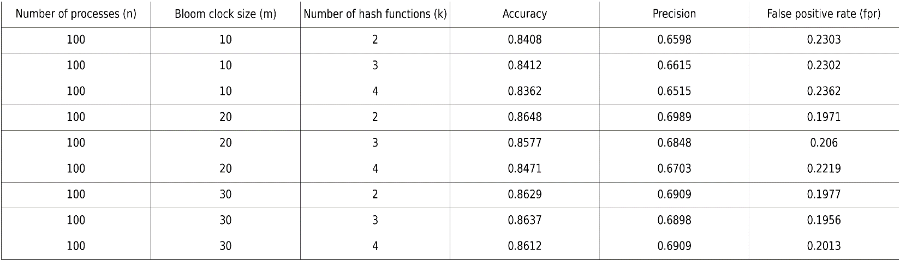
Now, with double the upper bound, we are including more events which are highly likely to be positives when compared to a fixed event y. Hence, the true positives increase, leading to a better accuracy, precision, and fpr. The longer we run the simulations, the better these metrics will get for any given combination of n, m, and k.

For n = 200:
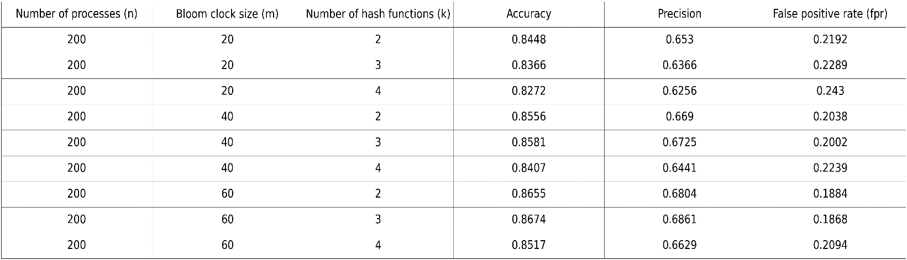
We saw that the metrics are better for larger upper bounds. Here, the upper bound is dependent on n (n^2 + 10n). Hence, as we increase the number of processes, the upper bound will also increase, and based on the previous argument, will lead to better overall metrics.

For n = 300:
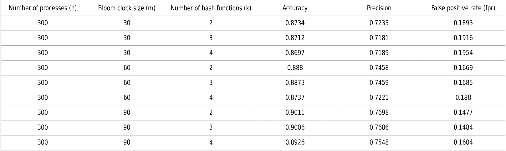
Again, we can observe that this higher n value has led to higher accuracies, precision, and lower false positive rate. If the upper bound was not based on n, then we could have seen similar metrics for different values of n.

### Estimated metrics
The following is the estimated metrics for the n = 100 simulation and will be compared with its actual counterpart.

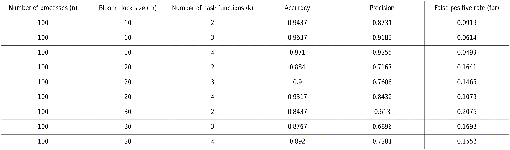
The accuracy and false positive rate (fpr) can be seen to be relatively close to the actual metrics. It is generally 10 to 15% higher than the actual metrics. But the estimation for the precision is a bit off from the actual precision. So, if we don’t have the actual vector clocks, bloom clocks can certainly be used to obtain a general range for the accuracy and false positive rate. The precision could be run for more parameters to see how close it can get to the actual values. Also, the difference could also be due to the approximation of the binomial function that has been used in this implementation. If the actual function was used, leaving aside the computational complexity, the estimated metrics could be much more accurate to the actual metrics. Since actual metrics for higher upper bound were generally higher, it could close the gap between the actual and estimated metrics. But here, the metrics get accurate to the actual values as the size of bloom clock is increased and the number of hash functions is decreased.

## Summary
To summarize, this simulation has shown us how much false positives do bloom clocks introduce. We have also learned the effect of different parameters on the result and the optimal parameters for n, m, k, internal event probability, and the execution slice range. We established that as an event z takes farther away from y, it is more likely to be a positive and less likely to be a false positive. Hence, the general trend is that the probability of positive increases as we get farther from the fixed event y.
Further, we saw approximation of the binomial function and calculation of the estimated metrics. This showed the feasibility of bloom clocks in real-world applications for replacing vector clocks.
Finally, the actual and estimated metrics were compared to show how statistical analysis of the simulations can be performed without using or simulating the vector clocks. There is a lot to learn from the data, some patterns or trends may not be directly visible and take more time and simulations to analyze carefully. As a future scope, these simulations could be easily scaled to run to machines that are capable of handling larger number of processes and could compute probability of positives without any approximation.

## References
[1] A.D. Kshemkalyani and A. Misra, The Bloom Clock to Characterize Causality in Distributed Systems, The 23rd International Conference on Network-Based Information Systems (NBiS2020), pp. 269-279, Springer, 2020. https://www.cs.uic.edu/~ajayk/ext/NBiS2020.pdf

[2] L. Ramabaja, The Bloom Clock, CoRR, vol. abs/1905.13064, 2019. [Online]. Available: http://arxiv.org/abs/1905.13064

